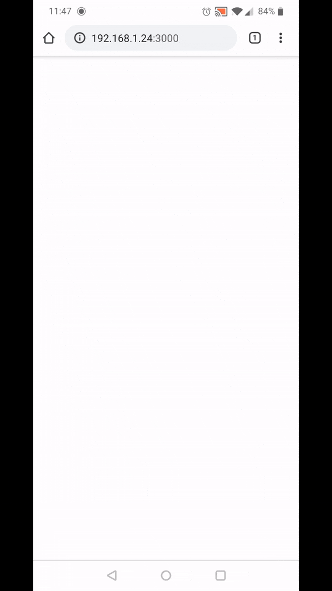

# Infinite whiteboard template

## About
This is a template for an infinite whiteboard that uses a ```<canvas>``` element.
An example site that has built on this code (adding collaboration and other features) can be found at [infiniboards.com](https://infiniboards.com).

## Accessing the whiteboard
You can open ```index.html``` to use the whiteboard in desktop mode, or run the ```Node.js``` server with:
```
node app.js
```
to access it at ```http://localhost:3000```. Depending on your firewall settings you should be able to connect to the server from a mobile device on your network by entering your computer's IP address in your mobile's browser like so: ```192.168.__.__:3000```.

## Desktop controls
- Left click to draw
- Right click to pan
- Scroll to zoom
## Mobile controls
- Single touch to draw
- Double touch to zoom / pan

## Example mobile use


*gif created with [ezgif](https://ezgif.com/)*
